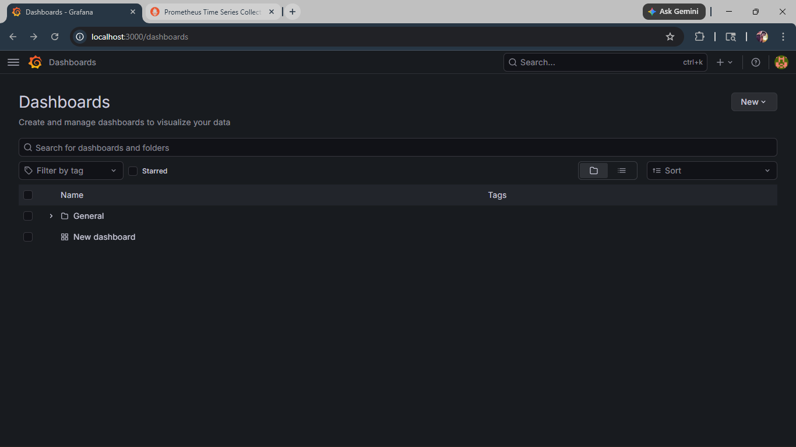
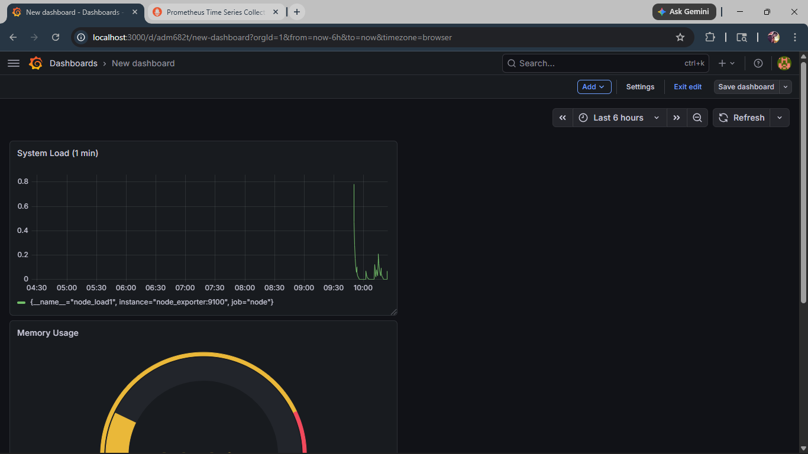
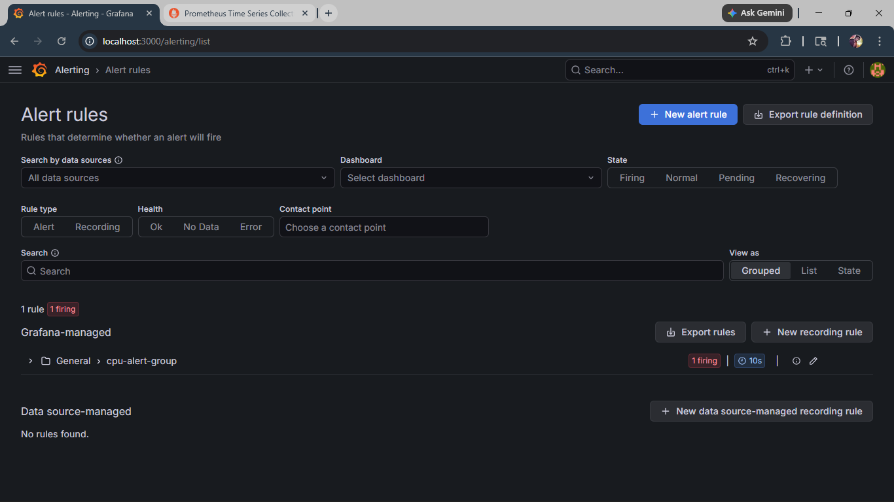
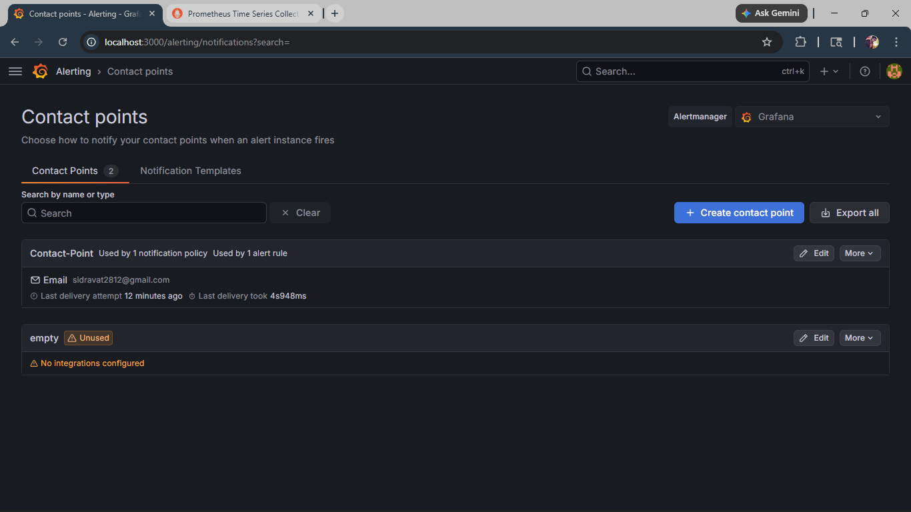

# 🚀 Monitoring & Alerting System using Prometheus and Grafana

## 📌 Overview

This project demonstrates a complete monitoring and alerting system using **Prometheus** and **Grafana**. It collects system metrics (CPU, memory, load), visualizes them in dashboards, and triggers alerts with email notifications when thresholds are exceeded.

---

## 🛠️ Tech Stack

* **Prometheus** – Metrics collection
* **Grafana** – Visualization & alerting
* **Node Exporter** – System metrics
* **Docker & Docker Compose** – Containerized setup

---

## 📊 Features

* 📈 Real-time system monitoring
* 📉 CPU, Memory, and Load dashboards
* 🚨 Alerting based on CPU usage threshold
* 📧 Email notifications on alert trigger
* ⚙️ Fully containerized setup

---

## 🧱 Project Structure

```
monitoring-alerting-system/
│
├── docker-compose.yml
├── prometheus.yml
├── README.md
└── screenshots/
    ├── dashboard.png
    ├── cpu-panel.png
    ├── alert-firing.png
    ├── email.png
    └── prometheus-targets.png
```

---

## ⚙️ Setup Instructions

### 1️⃣ Clone the Repository

```bash
git clone https://github.com/YOUR_USERNAME/monitoring-alerting-system.git
cd monitoring-alerting-system
```

---

### 2️⃣ Start Services

```bash
docker-compose up -d
```

---

### 3️⃣ Access Applications

* 🔹 Prometheus → http://localhost:9090
* 🔹 Grafana → http://localhost:3000

---

### 4️⃣ Grafana Login

```
Username: admin
Password: admin
```

---

## 🔌 Configure Prometheus Data Source

* Go to **Grafana → Connections → Data Sources**
* Select **Prometheus**
* Set URL:

```
http://prometheus:9090
```

* Click **Save & Test**

---

## 📈 Metrics & Queries

### 🔹 CPU Usage

```promql
100 - (avg(rate(node_cpu_seconds_total{mode="idle"}[1m])) * 100)
```

---

### 🔹 Memory Usage

```promql
(node_memory_MemTotal_bytes - node_memory_MemAvailable_bytes) / node_memory_MemTotal_bytes * 100
```

---

### 🔹 System Load

```promql
node_load1
```

---

## 🚨 Alert Configuration

* **Alert Name:** High CPU Usage
* **Condition:** CPU usage > 1
* **Evaluation Interval:** 10s
* **Notification:** Email

---

## 🧪 Testing Alert

Generate CPU load:

```bash
yes > /dev/null &
yes > /dev/null &
```

Expected result:

* Alert status → **FIRING 🔴**
* Email notification received 📧

---

## 📸 Screenshots

### 📌 Prometheus Targets


---

### 📌 Grafana Dashboard



---

### 📌 CPU Panel



---

### 📌 Memory Panel 


---

### 📌 Alert Firing



---

### 📌 Email Notification



---

## 🧠 Learning Outcomes

* Understanding monitoring architecture
* Writing PromQL queries
* Building dashboards in Grafana
* Implementing alerting systems
* Debugging container-based setups

---

## 🔥 Future Improvements

* Slack integration for alerts
* Kubernetes deployment
* Application-level monitoring
* Advanced dashboards

---

## 📌 Conclusion

This project demonstrates a practical implementation of monitoring and alerting in a DevOps environment. It provides real-time insights into system performance and ensures proactive issue detection.

---

## 👨‍💻 Author

Sid (CSE Student | DevOps Learner)
